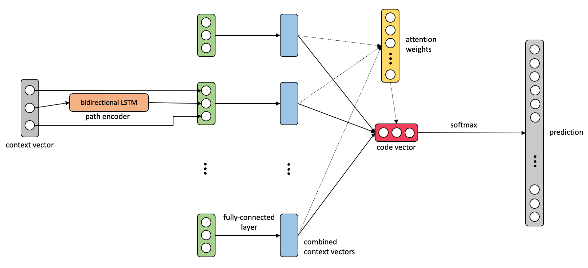

# PyTorch code2class

This repository contains an pytorch implementation of a network combination of
[code2vec: Learning Distributed Representations of Code](https://arxiv.org/abs/1803.09473)
and [code2seq: Generating Sequences from Structured Representations of Code](https://openreview.net/pdf?id=H1gKYo09tX).

The implementation is based on the pytorch code2vec implementation (https://github.com/bentrevett/code2vec) by [bentrevett](https://github.com/bentrevett).

It uses an added LSTM path encoding from code2seq and softmax label classification.

## Requirements

- Python 3+
- PyTorch
- A CUDA compatible GPU
- CometML

## Quickstart

1. `./download_preprocess.sh` to get the datasets from the code2seq paper.
2. `./preprocess.sh` to create necessary dictionary and format data. Also saves the files with suffix '.c2c'.
3. `python run.py`

## Data

### Context/Example Format
We have a training, testing and validation file, where:
  * Each row is an _example_.
  * Each _example_ is a space-delimited list of fields, where:
  1. The first field is the _target label_, internally delimited by the "|" character
  2. Each of the following fields are _contexts_, where each context has three components separated by commas (","). None of these components can include spaces nor commas.

  We refer to these three components as a _token_, a _path_, and another _token_, but in general other types of ternary contexts can be considered.

  Each _token_ is a token in the code.

  Each _path_ is a path between two tokens, split to path nodes (or other kinds of building blocks) using the "|" character.

One _example_ would look like:
`<label-1>|...|<label-n> <context-1> ... <context-m>`

Where each _context_ is:
`<left-token>,<path-node-1>|...|<path-node>,<right-token>`
Here `left-token` and `right-token` are _tokens_, and `<subtoken-1>|...|<subtoken-p>` is the syntactic _path_ that connects them.

One row/_example_ in a file could look like:
`target1|target2 token1,path|that|leads|to,token2 token3,another|path,token2`

### Files
The examples are split up into 3 files:
- `<data_dir>/<data>/<data>.train.c2c`
- `<data_dir>/<data>/<data>.test.c2c`
- `<data_dir>/<data>/<data>.val.c2c`

A dictionary (`<data_dir>/<data>/<data>.dict.c2c`)is also required. This will be created by running `./preprocess.sh`
