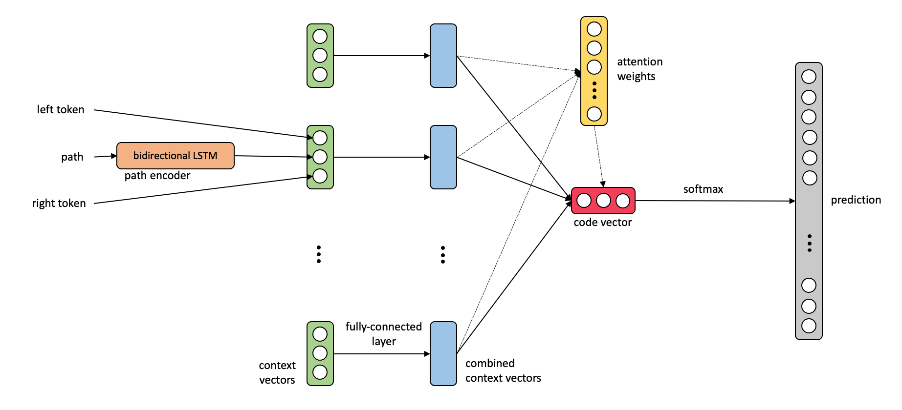

# PyTorch code2class

This repo contains an implementation of a network combination of  
[code2vec: Learning Distributed Representations of Code](https://arxiv.org/abs/1803.09473)  
and [code2seq: Generating Sequences from Structured Representations of Code](https://openreview.net/pdf?id=H1gKYo09tX)  
implemented with pytorch.

It uses an LSTM path encoding from code2seq and softmax label classification.

## Requirements

- Python 3+
- PyTorch
- A CUDA compatible GPU
- CometML

## Quickstart

1. `./download_preprocess.sh` to get the datasets from the code2seq paper.
2. `./preprocess.sh` to create necessary dictionary and format data.
3. `python run.py`

## Data

### Context/Example Format
We have a training, testing and validation file, where:
  * Each row is an example.
  * Each example is a space-delimited list of fields, where:
  1. The first field is the target label, internally delimited by the "|" character (for example: `compare|ignore|case`)
  2. Each of the following field are contexts, where each context has three components separated by commas (","). None of these components can include spaces nor commas.

  We refer to these three components as a token, a path, and another token, but in general other types of ternary contexts can be considered.

  Each token is a token in the code.

  Each path is a path between two tokens, split to path nodes (or other kinds of building blocks) using the "|" character.

One example would look like:
`<label-1>|...|<label-n> <context-1> ... <context-m>`

Where each context is:
`<left-token>,<subtoken-1>|...|<subtoken-p>,<right-token>`
Here `left-token` and `right-token` are tokens, and `<subtoken-1>|...|<subtoken-p>` is the syntactic path that connects them.

One row in a file could look like:
`target1|target2 token1,path|that|leads|to,token2 token3,another|path,token2`

### Files
The examples are split up into 3 files:
- `<data_dir>/<data>/<data>.train.c2s`
- `<data_dir>/<data>/<data>.test.c2s`
- `<data_dir>/<data>/<data>.val.c2s`

A dictionary (`<data_dir>/<data>/<data>.dict.c2s`)is also required. This will be created by running `./preprocess.sh`
